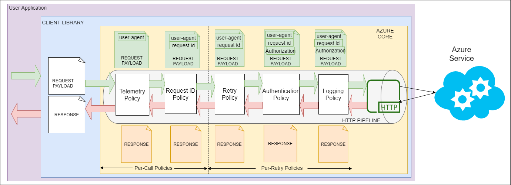

# HTTP clients & pipeline

## HTTP clients

The Azure SDK for Java is implemented using an `HttpClient` abstraction, which means that it has a pluggable architecture to enable support for multiple HTTP clients, as well as custom implementations when the need arises. However, because an Azure Java client library that does not know how to actually communicate over HTTP would be undesirable, the `azure-core` base library includes a default dependency on the `azure-core-http-netty` library, which means that, by default, all Azure client libraries use [Netty](https://netty.io).

Despite Netty being the default HTTP client used by all Azure client libraries, there are three implementations available for use by developers, depending on which dependencies they already have in their project. These are implementations for:

* [Netty](https://netty.io)
* [OkHttp](https://square.github.io/okhttp/)
* The new [HttpClient](https://openjdk.java.net/groups/net/httpclient/intro.html) introduced in JDK 11

As noted, by default all HTTP based SDKs add the Netty implementation as a dependency. Because this is included by default, users of the Java client libraries for Azure do not need to explicitly include any dependency.

### Replacing the Default HTTP Client

The dependency on Netty is removable if another implementation is preferred. This is done by excluding the Netty dependency in your build configuration files. In a Maven pom.xml, you would exclude the Netty dependency, and substitute another dependency. Note that the following example shows how the Netty dependency is excluded from a real dependency on the `azure-security-keyvault-secrets` library. Depending on the libraries readers are using, be sure to exclude Netty from all appropriate `com.azure` libraries, as such:

```xml
<dependency>
    <groupId>com.azure</groupId>
    <artifactId>azure-security-keyvault-secrets</artifactId>
    <version>4.2.2.</version>
    <exclusions>
      <exclusion>
        <groupId>com.azure</groupId>
        <artifactId>azure-core-http-netty</artifactId>
      </exclusion>
    </exclusions>
</dependency>
```

```xml
<dependency>
  <groupId>com.azure</groupId>
  <artifactId>azure-core-http-okhttp</artifactId>
  <version>1.3.3</version>
</dependency>
```

**NOTE**: If the Netty dependency is removed but no implementation is given in its place the application will fail to start. An `HttpClient` implementation must exist on the classpath.

### Configuring HTTP Clients

When building a service client it will default to using `HttpClient.createDefault()`, this returns a basic `HttpClient` based on the provided HTTP client implementation. If a more complex `HttpClient` is required, such as requiring a proxy, each implementation offers a builder that allows for a configured `HttpClient` to be constructed, these are `NettyAsyncHttpClientBuilder`, `OkHttpAsyncHttpClientBuilder`, and `JdkAsyncHttpClientBuilder`. These builders will share a common set of configurations such as proxying and communication port but will contain configurations that are specific to each implementation.


The following examples show how to build an `HttpClient` that proxies through `http://localhost:3128` and authenticates with user `example` whose password is `weakPassword`.

#### Netty

```java
HttpClient httpClient = new NettyAsyncHttpClientBuilder()
    .proxy(new ProxyOptions(ProxyOptions.Type.HTTP, new InetSocketAddress("localhost", 3128))
    .setCredentials("example", "weakPassword"))
    .build();
```

#### OkHttp

```java
HttpClient httpClient = new OkHttpAsyncHttpClientBuilder()
    .proxy(new ProxyOptions(ProxyOptions.Type.HTTP, new InetSocketAddress("localhost", 3128))
    .setCredentials("example", "weakPassword"))
    .build();
```

#### JDK 11 HttpClient

```java
HttpClient client = new JdkAsyncHttpClientBuilder()
    .proxy(new ProxyOptions(ProxyOptions.Type.HTTP, new InetSocketAddress("localhost", 3128)))
    .build();
```

> **TODO:** JdkAsyncHttpClientBuilder does not have a setCredentials API?

The constructed `HttpClient` can now be passed into a service client builder to be used as the client it uses to communicate to the service. The following example is using it to build a Azure Storage Blob client.

```java
BlobClient blobClient = new BlobClientBuilder()
    .connectionString(<connection string>)
    .containerName("container")
    .blobName("blob")
    .httpClient(httpClient)
    .build();
```

## HTTP pipeline

The HTTP pipeline is one of the key components in achieving consistency and diagnosability in the Java client libraries for Azure, which are two of the core design principles for all Azure SDKs, regardless of language. An HTTP pipeline is composed of:

* HTTP Transport
* HTTP pipeline policies

Users can provide their own [custom HTTP pipeline](#Custom-HTTP-Pipeline-Policy) when creating a client. If it's not provided, the client library will create one with all of the common policies required for the specific service that the library represents.

### HTTP Transport

The HTTP transport is responsible for establishing the connection to the server, as well as sending and receiving HTTP messages. It forms the gateway for the Azure SDK client libraries to interact with Azure services. As noted earlier in this document, Java by default uses [Netty](https://netty.io/) for its HTTP transport, but it also offers a pluggable HTTP Transport so that other implementations can be used where appropriate, as well as two additional HTTP transport implementations for OkHttp and the HttpClient that ships with JDK 11 and later.

### HTTP pipeline policies

A pipeline consists of a sequence of steps that are executed for each HTTP request-response roundtrip. Each policy has a dedicated purpose and will act on a request or a response or sometimes both. Because all client libraries are built on a standard 'Azure Core' layer, it will be used to ensure that each policy is executed in order in the pipeline. On the onward journey, i.e while sending a request, the policies are executed in the order in which they are added to the pipeline. When a response is received from the service, the policies are executed in the reverse order. Note that all policies added to the pipeline will be executed before the request is sent and after a response is received. The policy has to decide whether to act on the request, response or both. For example, a logging policy will log the request and response whereas the authentication policy is only interested in modifying the request.

The Azure Core framework will provide the policy with necessary request and response data along with any necessary context to execute the policy. The policy can then perform its operation with the given data and pass the control along to the next policy in the pipeline.



### HTTP Pipeline Policy Position

When making HTTP requests to cloud services, it is important to handle transient failures and retry failed attempts. As this is a very commonly needed functionality, Azure Core provides a retry policy that can watch for transient failures and automatically retry the request.

This retry policy, therefore, splits the whole pipeline into two parts. Policies that are executed before the retry policy and policies that are executed after. Policies that are added before the retry policy are executed only once per API operation and policies that are added after the retry policy will be executed as many times as the retries.

So, when building the HTTP pipeline, it is necessary to understand whether a policy should be executed each time a request is retried or if it is sufficient to execute it just once per API operation.

### Common HTTP pipeline policies

HTTP pipeline for REST-based services are generally configured with policies for authentication, retries, logging, telemetry and specifying request id in the header. Azure Core is pre-loaded with these commonly required HTTP policies that can be added to the pipeline.

| Policy                | GitHub link        |
|-----------------------|--------------------|
| Retry Policy          | [RetryPolicy.java](https://github.com/Azure/azure-sdk-for-java/blob/master/sdk/core/azure-core/src/main/java/com/azure/core/http/policy/RetryPolicy.java) |
| Authentication Policy | [BearerTokenAuthenticationPolicy.java](https://github.com/Azure/azure-sdk-for-java/blob/master/sdk/core/azure-core/src/main/java/com/azure/core/http/policy/BearerTokenAuthenticationPolicy.java) |
| Logging Policy        | [HttpLoggingPolicy.java](https://github.com/Azure/azure-sdk-for-java/blob/master/sdk/core/azure-core/src/main/java/com/azure/core/http/policy/HttpLoggingPolicy.java) |
| Request ID Policy     | [RequestIdPolicy.java](https://github.com/Azure/azure-sdk-for-java/blob/master/sdk/core/azure-core/src/main/java/com/azure/core/http/policy/RequestIdPolicy.java) |
| Telemetry Policy      | [UserAgentPolicy.java](https://github.com/Azure/azure-sdk-for-java/blob/master/sdk/core/azure-core/src/main/java/com/azure/core/http/policy/UserAgentPolicy.java) |

### Custom HTTP Pipeline Policy

The HTTP pipeline policy provides a convenient mechanism to modify or decorate the request and response. Custom policies can be added to the pipeline that is either created by the user or by the client library developer. When adding the policy to the pipeline, you can specify if this policy should be executed per-call or per-retry.

Creating a custom HTTP pipeline policy is as simple as extending a base policy type and implementing some abstract method. The policy can then be plugged in to the pipeline.
