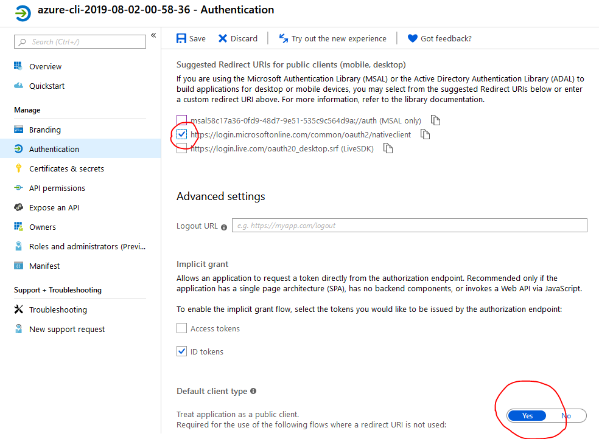
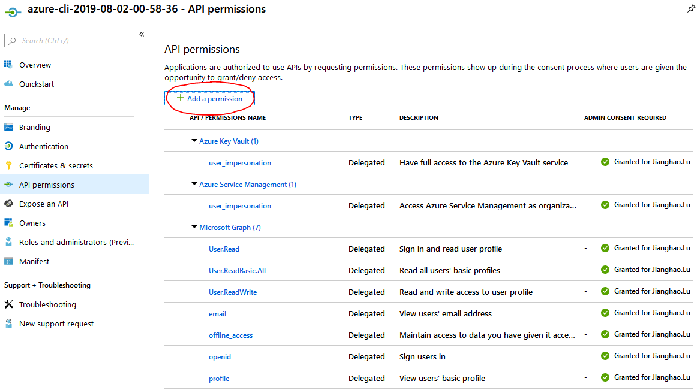
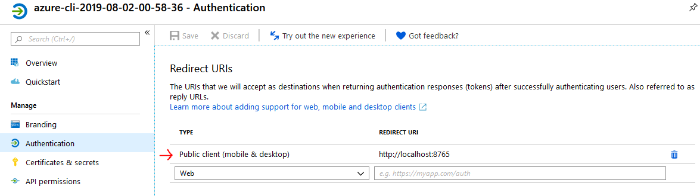
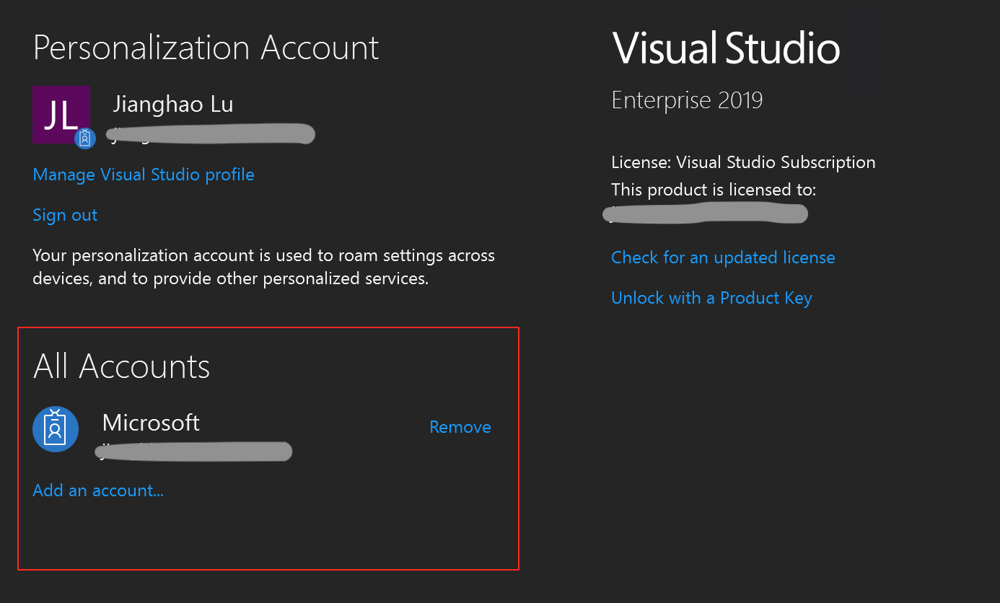
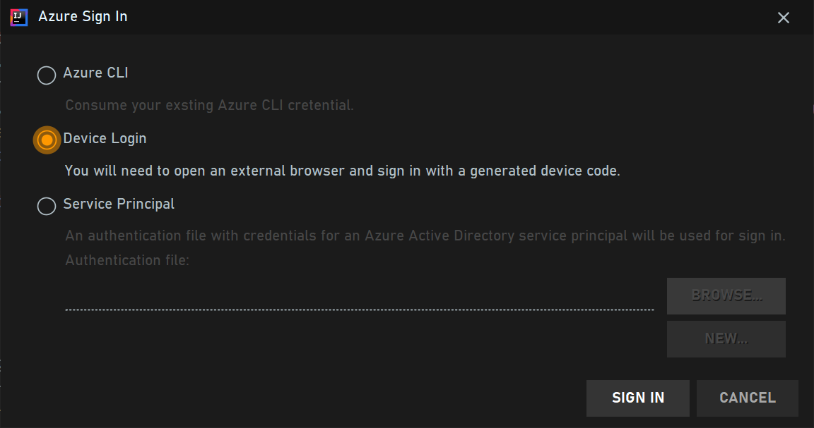
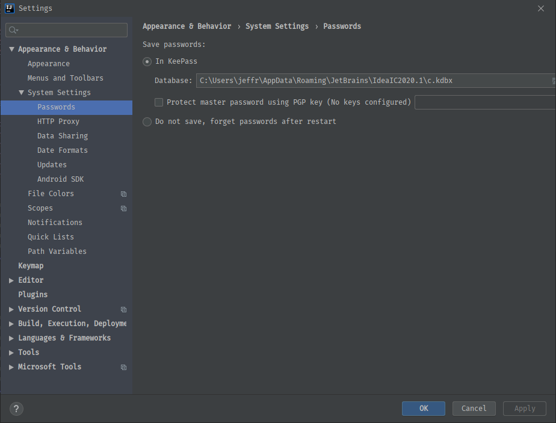
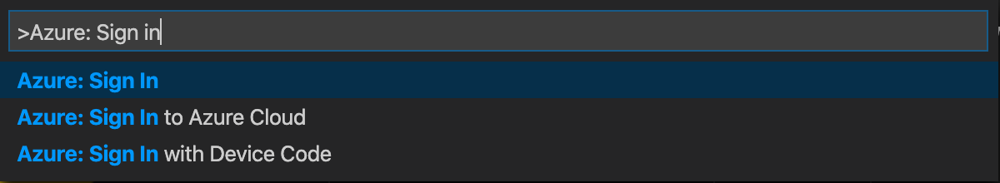
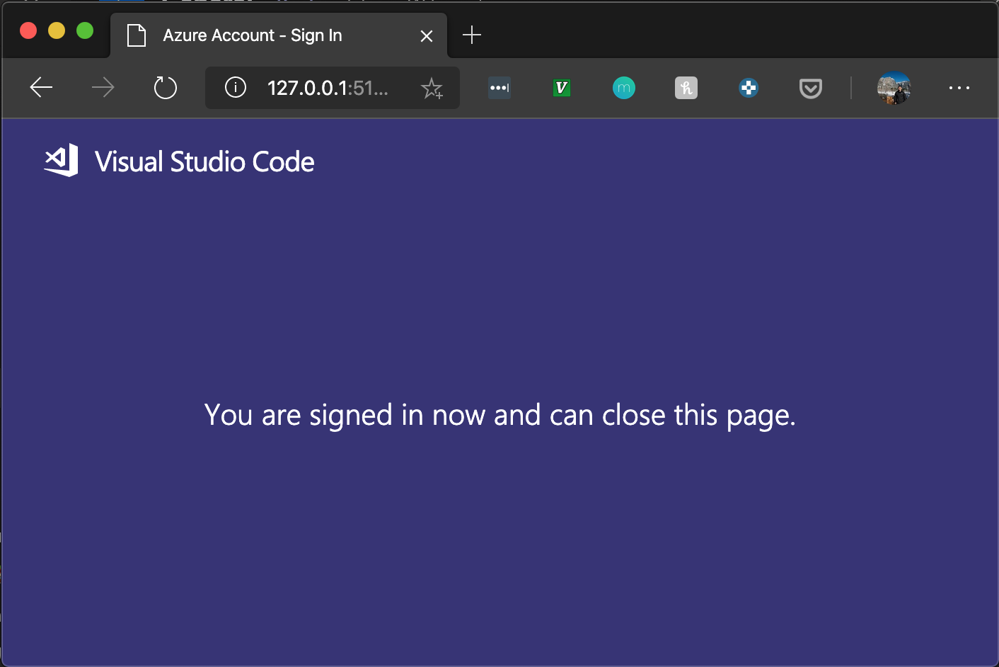
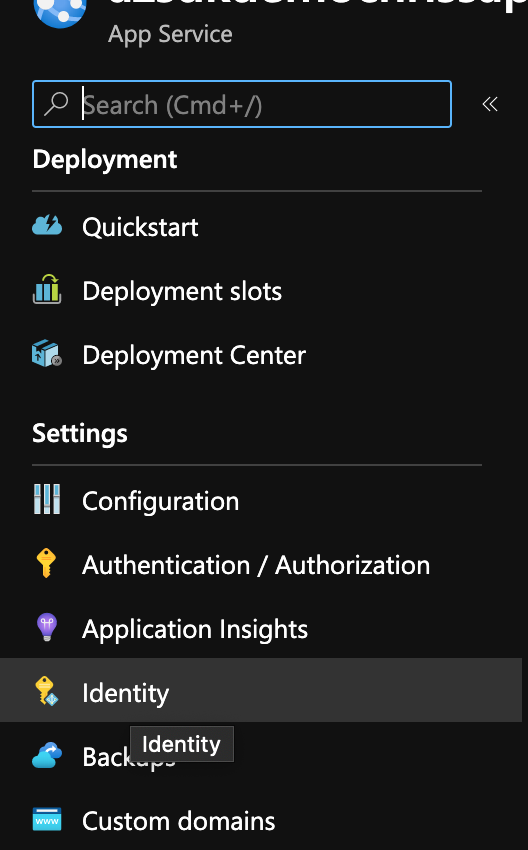

# Identity & authentication

The Azure Identity library provides Azure Active Directory token authentication support across the Azure SDK. It provides a set of TokenCredential implementations which can be used to construct Azure SDK clients which support AAD token authentication.

This library currently supports:

* [Service principal authentication](https://docs.microsoft.com/azure/active-directory/develop/app-objects-and-service-principals)
* [Managed identity authentication](https://docs.microsoft.com/azure/active-directory/managed-identities-azure-resources/overview)
* [Device code authentication](https://docs.microsoft.com/azure/active-directory/develop/v2-oauth2-device-code)
* Interactive browser authentication, based on [OAuth2 authentication code](https://docs.microsoft.com/azure/active-directory/develop/v2-oauth2-auth-code-flow)
* [Username + password authentication](https://docs.microsoft.com/en-us/azure/active-directory/develop/v2-oauth-ropc)
* IntelliJ authentication, with the login information saved in Azure Toolkit for IntelliJ
* Visual Studio Code authentication, with the login information saved in Azure plugin for Visual Studio Code
* Azure CLI authentication, with the login information saved in Azure CLI
* Shared Token Cache credential, which shares login information with Visual Studio, Azure CLI, and more

## Getting started

To learn how to get started, including getting the package and the prerequisites, please see the [README file](https://github.com/Azure/azure-sdk-for-java/blob/master/sdk/identity/azure-identity/README.md) in azure-identity library source.

## Set up your environment for authentication

### Configure `DefaultAzureCredential`

`DefaultAzureCredential` supports a set of configurations through setters on the `DefaultAzureCredentialBuilder` or environment variables.

* Setting environment variables `AZURE_CLIENT_ID`, `AZURE_CLIENT_SECRET`, and `AZURE_TENANT_ID` as defined in [Environment Variables](#environment-variables) configures the `DefaultAzureCredential` to authenticate as the service principal specified by the values.
* Setting `.managedIdentityClientId(String)` on the builder or environment variable `AZURE_CLIENT_ID` configures the `DefaultAzureCredential` to authenticate as a user defined managed identity, verse leaving them empty configures it to authenticate as a system assigned managed identity.
* Setting `.tenantId(String)` on the builder or environment variable `AZURE_TENANT_ID` configures the `DefaultAzureCredential` to authenticate to a specific tenant for shared token cache, Visual Studio Code and IntelliJ IDEA.
* Setting environment variable `AZURE_USERNAME` configures the `DefaultAzureCredential` to pick the corresponding cached token from the shared token cache.
* Setting `.intelliJKeePassDatabasePath(String)` on the builder configures the `DefaultAzureCredential` to read a specific KeePass file when authenticating with IntelliJ credentials.

### Creating a Service Principal with the Azure CLI

Use the [Azure CLI][azure_cli] snippet below to create/get client secret credentials.

* Create a service principal and configure its access to Azure resources:

```bash
az ad sp create-for-rbac -n <your-application-name> --skip-assignment
```

Output:

```json
{
    "appId": "generated-app-ID",
    "displayName": "dummy-app-name",
    "name": "http://dummy-app-name",
    "password": "random-password",
    "tenant": "tenant-ID"
}
```

* Run `az ad sp create-for-rbac -n <your-application-name> --skip-assignment --cert <cert-name> --create-cert` to create a service principal along with a certificate.

* Use the returned credentials above to set  **AZURE\_CLIENT\_ID**(appId), **AZURE\_CLIENT\_SECRET**(password) and **AZURE\_TENANT\_ID**(tenant) [environment variables](#environment-variables).

### Enable applications for device code flow

In order to authenticate a user through device code flow, you need to go to Azure Active Directory on Azure Portal and find you app registration and enable the following 2 configurations:



This will let the application authenticate, but the application still doesn't have permission to log you into Active Directory, or access resources on your behalf. Open API Permissions, and enable Microsoft Graph, and the resources you want to access, e.g., Azure Service Management, Key Vault, etc:



Note that you also need to be the admin of your tenant to grant consent to your application when you login for the first time. Also note after 2018 your Active Directory may require your application to be multi-tenant. Select "Accounts in any organizational directory" under Authentication panel (where you enabled Device Code) to make your application a multi-tenant app.

### Enable applications for interactive browser oauth 2 flow

You need to register an application in Azure Active Directory with permissions to login on behalf of a user to use InteractiveBrowserCredential. Follow all the steps above for device code flow to register your application to support logging you into Active Directory and access certain resources. Note the same limitations apply that an admin of your tenant must grant consent to your application before any user account can login.

You may notice in `InteractiveBrowserCredentialBuilder`, a port number is required, and you need to add the redirect URL on this page too:



In this case, the port number is 8765.

## Enable applications for oauth 2 auth code flow

You need the same application registered as in [Enable applications for interactive browser oauth 2 flow](#enable-applications-for-interactive-browser-oauth-2-flow), except that the redirect URL must be an API endpoint on your web application where the auth code must be handled as a query parameter.

### Enable applications for shared token cache credential

You will need to have Visual Studio 2019 installed. Login to Visual Studio with your org ID or live ID and you are ready to use shared token cache credential.

Open your Visual Studio account settings and you can see the list of accounts with cached tokens in the red rectangle below. Note the Personalization Account is not related to this token cache. You can delete all info and tokens of this account in the token cache by removing the account here and closing the Visual Studio window.



If you have multiple accounts listed here, you must specify the `AZURE_USERNAME` environment variable to the email of the account you'd like to use for all the authentications.

If you see an error "MSAL V3 Deserialization failed", try clearing the cache in `C:\Users\{username}\AppData\Local\.IdentityService`.

### Sign in Azure CLI for AzureCliCredential

Sign in [Azure CLI][azure_cli] with command

```bash
az login
```

as a user, or

```bash
az login --service-principal --username <client-id> --password <client-secret> --tenant <tenant-id>
```

as a service principal.

If the account / service principal has access to multiple tenants, make sure the desired tenant or subscription is in the state "Enabled" in the output from command:

```bash
az account list
```

Before you use AzureCliCredential in the code, run

```bash
az account get-access-token
```

to verify the account has been successfully configured.

You may have to repeat this process after a certain period (usually a few weeks to a few months based on the refresh token validity configured in your organization). AzureCliCredential will prompt you to sign in again.

### Sign in Azure Toolkit for IntelliJ for IntelliJCredential

In your IntelliJ window, open File -> Settings -> Plugins. Search “Azure Toolkit for IntelliJ” in the marketplace. Install and restart IDE.

Now you should be able to find a new menu item Tools -> Azure -> Azure Sign In…



Device Login will help you login as a user account. Follow the instructions to login on the login.microsoftonline.com website with the device code. IntelliJ will prompt you to select your subscriptions. Please select the 

On Windows, you will also need the KeePass database path to read IntelliJ credentials. You can find the path in IntelliJ settings under File -> Settings -> Appearance & Behavior -> System Settings -> Passwords:



### Sign in Visual Studio Code Azure Account Extension for VisualStudioCodeCredential

The Visual Studio Code authentication is handled by an integration with the [Azure Account extension](https://marketplace.visualstudio.com/items?itemName=ms-vscode.azure-account). To use, install the Azure Account extension, then use View->Command Palette to execute the “Azure: Sign In” command:



This will open a browser that allows you to sign in to Azure. Once you have completed the login process, you can close the browser as directed. Running your application (either in the debugger or anywhere on the development machine) will use the credential from your sign-in.



### Enable managed identity for Azure resources

#### Cloud shell

A system assigned managed identity is enabled by default in [Azure Cloud Shell](https://shell.azure.com).

#### Virtual machines, App Services, Function Apps

Go to [Azure Portal](https://portal.azure.com) and navigate to your resource. You should see an "Identity" tab:



You will be able to configure either system assigned or user assigned identities. For user assigned identities, the client ID of the managed identity must be used to create the `ManagedIdentityCredential` or `DefaultAzureCredential`.

#### Kubernetes Services (AKS)

Only user assigned identities are currently supported in AKS with the [AAD Pod Identity](https://github.com/Azure/aad-pod-identity) plugin. Please follow the instructions in the repo as it may change between versions.

<!-- LINKS -->
[azure_cli]: https://docs.microsoft.com/cli/azure
[azure_sub]: https://azure.microsoft.com/free/
[source]: ./
[aad_doc]: https://docs.microsoft.com/azure/active-directory/
[code_of_conduct]: https://opensource.microsoft.com/codeofconduct/
[keys_client_library]: ../../keyvault/azure-security-keyvault-keys
[secrets_client_library]: ../../keyvault/azure-security-keyvault-secrets
[eventhubs_client_library]: ../../eventhubs/azure-messaging-eventhubs
[azure_core_library]: ../../core
[javadoc]: http://azure.github.io/azure-sdk-for-java
