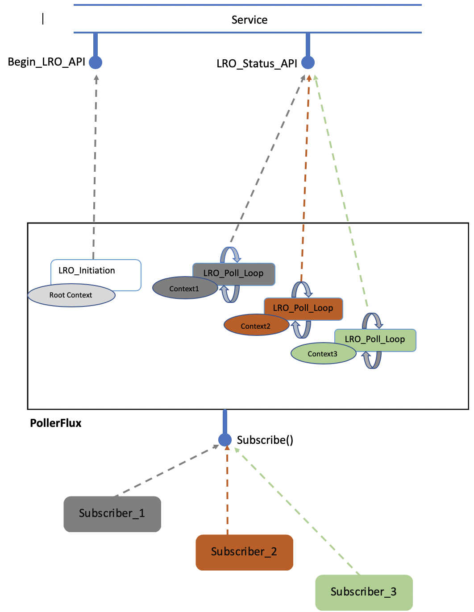

# Long-running operations

## PollerFlux

`PollerFlux` is the client side abstraction to interact with server side Long Running Operations (LRO). It is a Flux to which multiple subscribers interested in the LRO events can subscribe.

This page describes internals of `PollerFlux` and how to create `PollerFlux` for an LRO.

The work that `PollerFlux` doing is two stage execution. First stage is **LRO initiation** and second stage is **LRO Poll Loop**. Following figure shows `PollerFlux` instance with 3 subscriptions.



### "LRO initiation" stage

Irrespective of the number of subscribers, a `PollerFlux` instance "successfully" execute "LRO initiation" stage only once.

If an attempt of "LRO initiation" as a result of first subscription fails (e.g. service is busy) then `PollerFlux` will attempt to execute "LRO initiation" stage upon the next subscription. Once an attempt succeeded then this stage won't be executed for any future subscriptions. This is why it was stated earlier that - *`PollerFlux` instance "successfully" execute "LRO initiation" stage only once*.

### "LRO Poll Loop" stage

When a subscription result in successful one time execution of "LRO initiation" stage, the `PollerFlux` execute "LRO Poll Loop" stage for that subscription. For future subscriptions `PollerFlux` skip "LRO initiation" but execute "LRO Poll Loop" stage for those subscriptions. i.e. one "LRO Poll Loop" execution per subscription.

"LRO Poll Loop" is an asynchronous loop that keeps polling at regular intervals for the LRO status. The loop exit when the LRO completes in the server. The completion can be a successful completion or errored completion.

### "LRO initiation" and "LRO Poll" Functions

Given `PollerFlux` is a generic abstraction for any LRO, as part of creating a `PollerFlux` instance, we need to specify what exact work to do during "LRO initiation" stage and each iteration of "LRO Poll Loop" stage. We will need to provide Functions that describe these works (a.k.a `Stage Functions`) as `PollerFlux` constructor parameters. The two `Stage Functions` are "LRO initiation" Function and "LRO Poll" Function.

#### PollerContext

A type that closely work with `PollerFlux` is `PollingContext`. `PollingContext` is a map in which key-value pairs can be stored and retrieved. This type is optionally used by the `Stage Functions` to manage state. We'll see usage of this type later in this page.

### Example: PollerFlux for Foo resource creation

Let's use an example to simplify the discussion around `PollerFlux`. Say we have an API client like below which enable us to create Foo resource, provisioning of this resource is a Long Running Operation. Client expose two API:  

1. `createFoo`: start the creation of Foo resource.
2. `checkCreateFooStatus`: check the status of the create operation.

```java
class FooClientImpl {
    // The api to initiate LRO.
    Mono<CreateFooResponse> createFoo(params) {
      // REST call to Foo Service to initiate LRO
      // POST /Foo?name=foo1
    }

    // The api checks status of LRO with given operationId.
    //
    // a. This API return statusCode 202 if the LRO is in progress.
    // b. Status code 200 is returned when Operation Complete. With 200  
    //    the CreateFooStatusResponse::completionState property can have
    //    two possible values "Succeeded" or "Failed".
    //
    Mono<CreateFooStatusResponse> checkCreateFooStatus(String operationId) {
       // REST call to Foo Service for status
       // GET /OperationStatus/{operationId}
    }
}
```

As we explore the `PollerFlux`, we will implement a `PollerFlux` for the LRO that creates Foo. 

Let's get into "LRO initiation" and "LRO Poll" Functions.

### "LRO initiation" Function

This Function gets called during execution of "LRO initiation" stage. This Function is provided as constructor argument to `PollerFlux` and has following signature:

```java
Function<PollingContext<T>, Mono<T>>
```

When executing "LRO initiation" stage, this Function will be called with an instance of `PollingContext`. The stage subscribe to the `Mono` returned by this function. The `Mono` should compose/contain the work to be executed, usually the work is making a service call to start LRO. `Mono` should emit any result produced by the work, where `T` is the result type. `T` can be `Void` which indicate there is no result.

example: we can create such a Function for the example FooClientImpl as below:

```java
Function<PollingContext<FooCreateLroResult>, Mono<FooCreateLroResult>> initFunc 
    = (context) -> {
                       fooClient.createFoo(params)
                       .map(r) -> {
                           context.setData("operationId", r.operationId);
                           return new FooCreateLroResult(r);
                       })
                   };
```

This example "LRO initiation" Function make use of `PollingContext` to store the `operationId` returned by the `createFoo` call. Any such stored data will be available for "LRO Poll" Function from its context.

`FooCreateLroResult` is a POJO which contain any interesting information from the Foo service that we want to expose to the consumer. 

### "LRO Poll" Function

This Function gets called mutliple times, one call per each iteration of the loop in the "LRO Poll Loop" stage. This Function is provided as constructor argument to `PollerFlux` and has following signature:

```java
Function<PollingContext<T>, Mono<PollResponse<T>>>
```

As mentioned earlier the "LRO Poll Loop" stage will be executed per subscription. A new instance of `PollingContext` will be created for each execution of this stage, all invocations of this Function from the poll loop within an execution will share same `PollingContext` instance. That is, one `PollingContext` instance per execution/subscription. 

Note that the "LRO initiation" Function was invoked with a `PollingContext` instance. This context is known as `Root` Context. Each `PollingContext` instance per "LRO Poll Loop" will be initialized with a copy of key-value pairs in the `Root` Context.

The Mono returned by this Function should compose/contain the work to be executed, usually the work is making a call to the service for LRO status, `Mono` should emit any result produced by the work as an instance of `PollResponse<T>`.

example: we can create such a Function for the example FooClientImpl like below:

```java
Function<PollingContext<FooCreateLroResult>, Mono<PollResponse<FooCreateLroResult>>> pollFunc = (context) -> {
    fooClient.checkCreateFooStatus(context.getData("operationId"))
        .map(r) -> {
            if (r.statusCode == 201) {
                return new PollResponse(LongRunningOperationStatus.IN_PROGRESS, new FooCreateLroResult(r));
            } else if (r.statusCode == 200) {
                if (r.completionState.equals("Succeeded") ) {
                    return new PollResponse(LongRunningOperationStatus.SUCCESSFULLY_COMPLETED, 
                        new FooCreateLroResult(r));
                } else {
                    return new PollResponse(LongRunningOperationStatus.FAILED, 
                        new FooCreateLroResult(r));
                }
            }
        })
};
```

This example "LRO Poll" Function reads the `operationId` from the context (the `operationId` set by "LRO Initiation" Function) and use it as argument for `checkCreateFooStatus` service call.

### Response accessors in PollingContext

In addition to enabling store and retrieval key-value pairs, `PollingContext` also exposes two Response accessors:

```java
class PollingContext {
    public PollResponse<T> getActivationResponse() {..}
    public PollResponse<T> getLatestResponse() {...}
}
```

`getActivationResponse()` returns a `PollResponse` that composes the result returned by "LRO Initiation" Function. 
`getLatestResponse()` returns the `PollResponse` returned by the last invocation of "LRO Poll" Function.

This is useful if "LRO Poll" Function need these responses to prepare data for next LRO status service call.

### Creating PollerFlux instance

When creating `PollerFlux` above two `Stage Functions` can be provided as constructor arguments:

example:
```java
PollerFlux<FooCreateLroResult, Void> createFooPollerFlux = new PollerFlux<>(Duration.ofSeconds(2), 
    initFunc,  // "LRO initiation" Function
    pollFunc,  // "LRO Poll" Function
    /*cancelFunc*/, 
    /*fetchFinalResultFunc*/);
```

We will come to `/*cancelFunc*/`, `/*fetchFinalResultFunc*/` arguments later. 

#### Poll Interval

The first parameter is the default delay between each call to "LRO Poll" Function. The "LRO Poll" Function can override this by setting the desired delay in the `PollResponse` instance it returns. Each iteration of pooling loop calls `PollResponse::getRetryAfter()` and if it returns a non-null `Duration` then that will used as the current delay.

```java
new PollResponse(LongRunningOperationStatus.IN_PROGRESS, 
    new FooCreateLroResult(r),
    /* derive delay from the response header */
    Duration.ofMillis(Long.parseLong(r.headers("Retry-After"))));
```
### AsyncPollResponse

PollerFlux can be consumed just like any Flux. The `PollerFlux` subscribers receives stream of `AsyncPollResponse`. Each iteration of polling loop creates an instance of `AsyncPollResponse` that composes the `PollResponse` from the "LRO Poll" Function call and gets delivered to the Subscriber.

```java
createFooPollerFlux.doOnNext(asyncPollResponse -> {
   LongRunningOperationStatus status = asyncPollResponse.getStatus(); // Current Poll Status
   FooCreateLroResult pollResult = asyncPollResponse.getValue(); // Current Poll Result
   // ...
});

```

### "Cancel" and "FetchFinalResult" Functions

In addition to retrieving LRO status and poll result, `AsyncPollResponse` has two interesting methods in it `cancelOperation` and `getFinalResult`.

```java
public final class AsyncPollResponse<T, U> {
    // ...
    public Mono<T> cancelOperation() {...};

    public Mono<U> getFinalResult() {...};
    // ...
}
```

#### AsyncPollResponse::cancelOperation()

There are services that supports cancelling the LRO executing in the service side. The `cancelOperation()` in `AsyncPollResponse` enables Subscriber to cancel the LRO from reactor operator chain.

example: In the following code we wait 30 minutes for Foo resource to be completely provisioned, if not then the LRO will be cancelled.

```java
createFooPollerFlux.take(Duration.ofMinutes(30))
    .last()
    .flatMap(asyncPollResponse -> {
        if (!asyncPollResponse.getStatus().isComplete()) {
            return asyncPollResponse
                .cancelOperation()
                .then(Mono.error(new RuntimeException("Operation is cancelled!")));
        } else {
            return Mono.just(asyncPollResponse);
        }
    }).block();
```

#### "Cancel" Function

One of the constructor argument to `PollerFlux` is "Cancel" Function, this Function is called when Subscriber invokes `AsyncPollResponse::cancelOperation()`.

"Cancel" Function has the following signature.

```java
BiFunction<PollingContext<T>, PollResponse<T>, Mono<T>>
```

This Function is called with the `PollingContext` associated with the Subscription and the `PollResponse` composing the result returned by the "LRO Initiation" Function.

The `Mono` returned by this Function will be returned from the `AsyncPollResponse::cancelOperation()`.

#### AsyncPollResponse::getFinalResult()

There are services that require client calling an API to retrieve the final result of LRO. The `getFinalResult()` in `AsyncPollResponse` enables Subscriber to retrieve such result from reactor operator chain.

#### "FetchResult" Function

One of the constructor argument to `PollerFlux` is "FetchResult" Function, this Function is called when Subscriber invokes `AsyncPollResponse::getFinalResult()`.

"FetchResult" Function has the following signature.

```java
Function<PollingContext<T>, Mono<U>> 
```

This Function is called with the `PollingContext` associated with the Subscription. The `Mono` returned by this Function will be returned from the `AsyncPollResponse:: getFinalResult()`.
